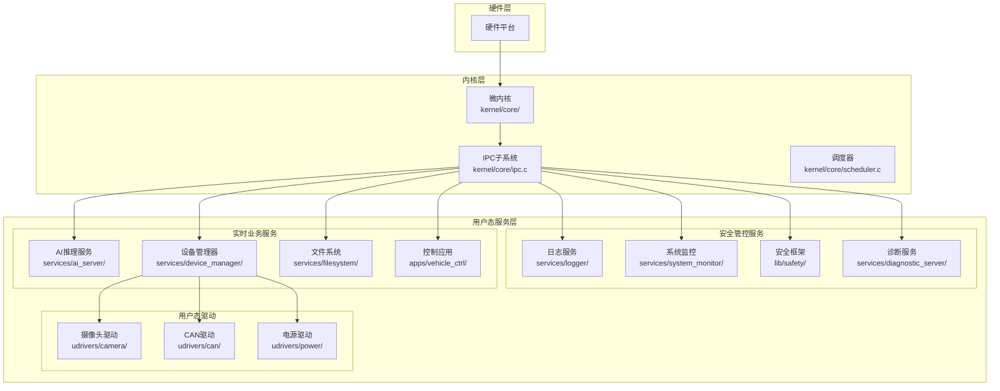
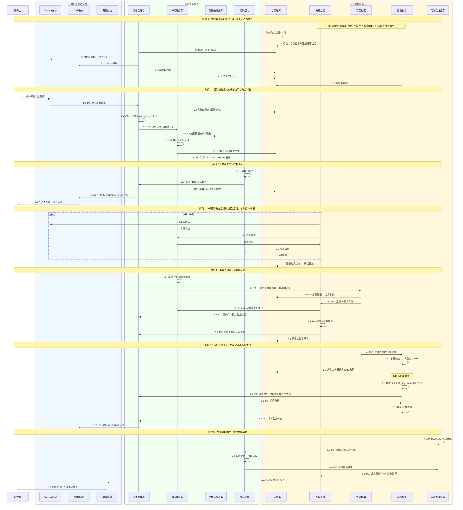
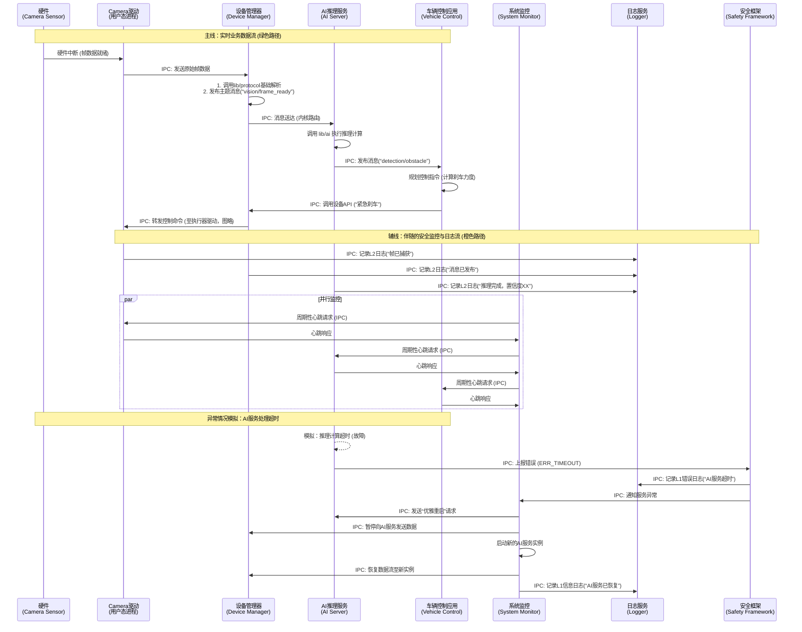
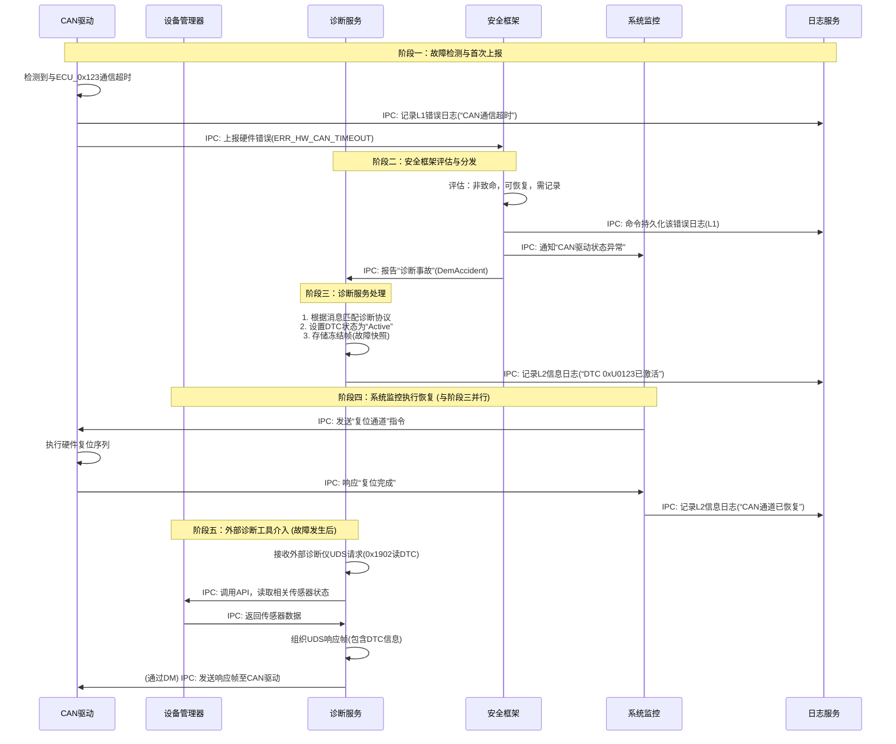
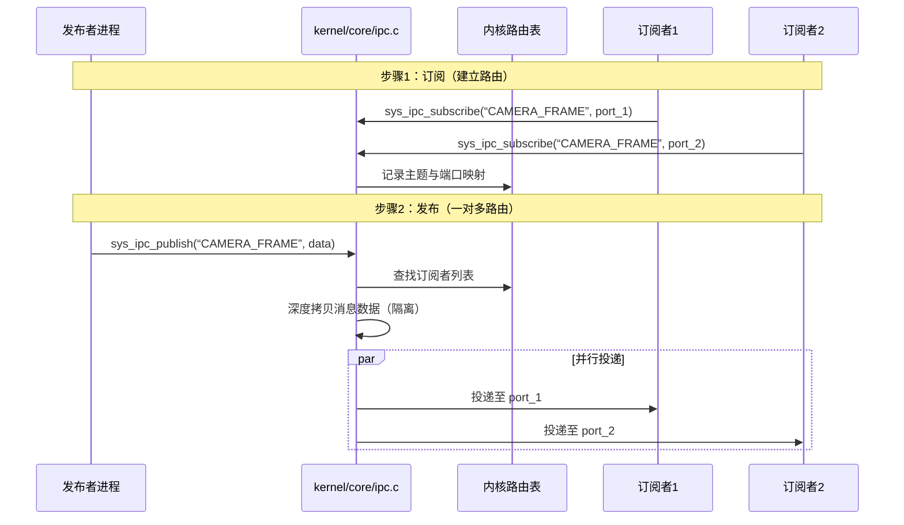
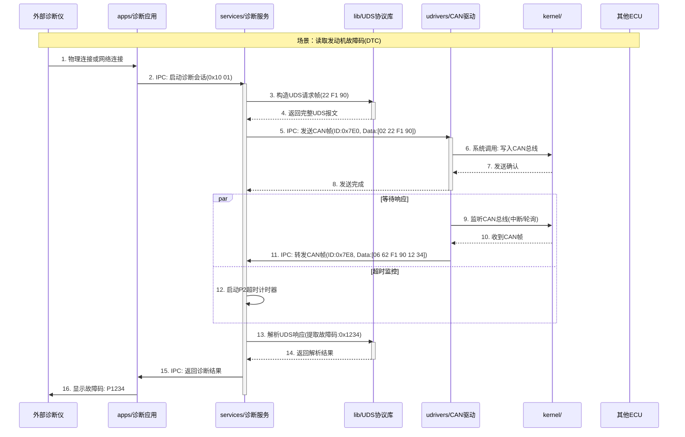
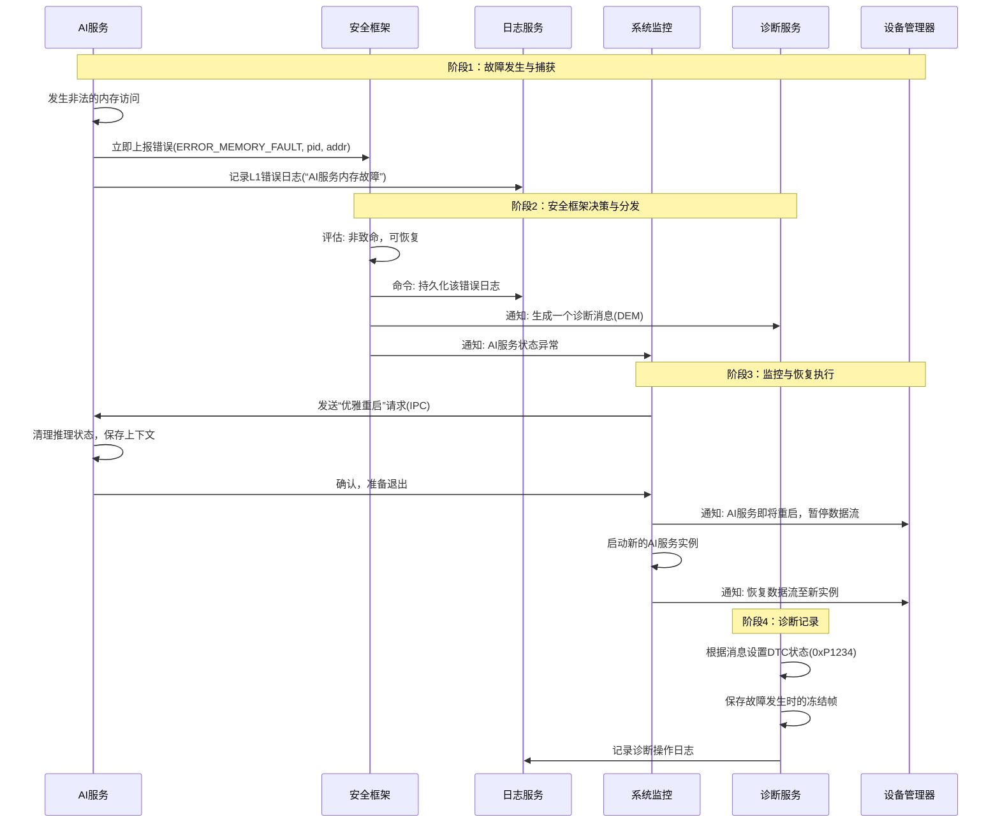
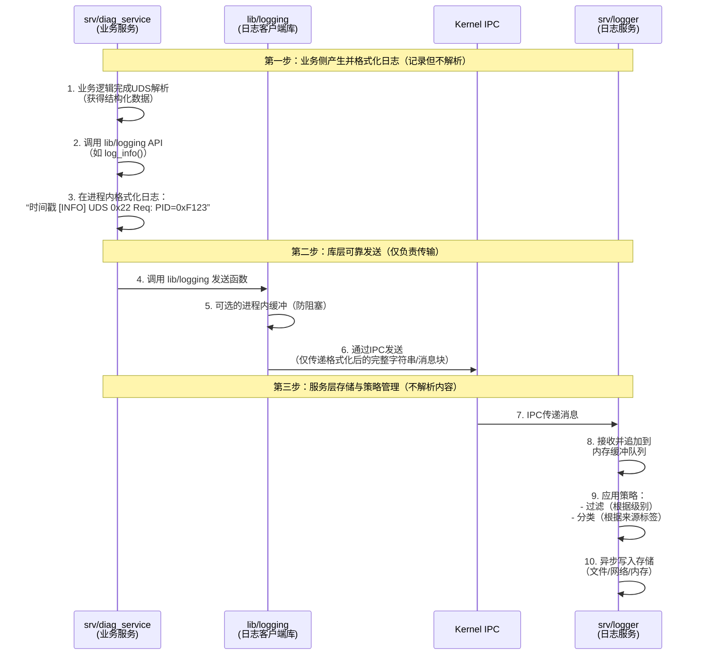

# AutoMLOS 系统架构设计文档

## 概述

AutoMLOS 是一个面向汽车电子系统的实时微内核操作系统，专为自动驾驶和高级驾驶辅助系统(ADAS)设计。系统采用模块化架构，确保功能安全(ASIL-D)和实时性能。
- **安全第一**：符合ISO 26262功能安全标准
- **实时性能**：微秒级中断延迟，确定性调度
- **模块化设计**：服务隔离，单一故障不扩散
- **可扩展性**：支持动态服务加载和卸载

## 系统架构总览


## 性能指标

| 指标 | 目标值 | 当前状态 | 备注 |
|------|--------|----------|------|
| 中断延迟 | <10µs | 待测试 | 微内核设计目标 |
| 上下文切换 | <5µs | 待测试 | 进程间切换 |
| IPC消息延迟 | <20µs | 待测试 | 内核路由延迟 |
| 内存使用 | <2MB | 待测试 | 核心服务内存 |
| 启动时间 | <100ms | 待测试 | 冷启动到就绪 |


### 功能安全 (ISO 26262)
- **ASIL-D兼容**：最高安全完整性等级
- **故障检测**：运行时错误检测和报告
- **安全状态**：故障时进入安全状态
- **诊断覆盖**：完整的诊断和监控机制

### 信息安全
- **内存保护**：进程隔离，防止越界访问
- **通信安全**：消息完整性检查，防止篡改
- **访问控制**：基于角色的服务访问权限

## 核心特性
**1.  汽车级功能安全 (ASIL-D Ready)**
- 架构级隔离：每个服务/驱动为独立进程，单一故障不会扩散。

- 时间确定性：微内核极小（<10µs中断延迟），调度器支持时间分区。

- 软件各模块解耦，日志只记录不分析，四级日志系统：

    - L0 (紧急)：内核及安全关键事故，同步存储于安全内存。

    - L1 (错误)：系统级错误，高可靠性存储。

    - L2 (信息)：业务流水线日志，循环存储。

    - L3 (调试)：开发调试信息，可配置丢弃。

**2.  深度集成的实时TinyML**
- 专用服务：ai_server 管理模型生命周期与推理任务调度。

- 内存优化：lib/ai 包含张量内存池、算子融合，峰值内存<512KB。

- 车规适配：支持-40°C~125°C温度范围的精度补偿。

**3.  符合AUTOSAR标准的诊断栈**
- 完整UDS：lib/protocol/uds 实现ISO-14229，diagnostic_server 处理会话安全。

- DTC管理：完整的诊断故障码生命周期管理与冻结帧存储。

- DoIP支持：通过network服务支持基于以太网的诊断。

**4.  高性能纯IPC通信架构**
- 零共享内存（默认）：所有通信通过IPC消息传递，确保数据流清晰、可审计。

- 大数据的优化路径：对摄像头帧等大数据，采用“共享内存+IPC小消息通知”的混合模式，由device_manager管理。

- 背压控制：IPC通道内置流控，防止快速生产者淹没慢速消费者。


## 核心工作机制

### IPC消息机制
autoMLOS采用基于**主题（Topic）的IPC消息机制**，而非传统的事件机制，确保通信的高效性和确定性。
- **消息机制**：基于主题的发布-订阅模式，内核提供统一路由，传统机制通常需要复杂的回调注册和分发逻辑
- **设计选择**：采用消息机制实现更好的解耦和性能
- **集中路由**：所有消息通过内核路由表统一分发
- **策略路由**：支持广播、单播、组播等多种路由策略
- **扩展友好**：支持动态主题注册和发现
- **深度拷贝**：消息数据在内核层深度拷贝，确保隔离安全
- **零共享内存**：默认使用纯IPC消息传递
- **大数据优化**：摄像头帧等大数据采用"共享内存+IPC小消息通知"混合模式
- **背压控制**：IPC通道内置流控机制
- **消息处理流程**
    ```
    发布者 → sys_ipc_publish() → 内核路由表 → 深度拷贝 → 并行投递 → 订阅者
    ``` 
- **分层命名**：主题名称直接反映业务语义，`domain/component/action`格式（如`vision/camera/frame_ready`）
- **通信机制：IPC消息机制**
    详细的消息类型定义请参考：[消息类型定义规范](msg_types.md)

### 系统设计完整序列图

- 系统上电 → 硬件看门狗启动 → BSP时钟初始化 → 内核启动 → 用户态服务启动
- 微内核启动 → Logger → Monitor → DeviceManager → UDrivers → 业务服务


这张图通过 6个阶段 和 3个并行泳道，系统地串联了所有模块：

1. 严格的分层与启动顺序（阶段0）

    - 直观展示了 “基础设施先行” 的原则：日志服务和系统监控必须先于所有业务服务启动，这是构建可观测和可恢复系统的前提。

2. 业务流与安全流解耦且并行（阶段1-3）

    - 绿色路径（阶段1-2） 是主线业务，代表车辆功能（感知-决策-控制）。

    - 橙色路径（阶段3） 是安全监控，代表系统的“免疫系统”。它与业务流异步并行，通过定期心跳进行检查，确保不干扰主功能的实时性。

3. 完整的故障生命周期处理（阶段4-5）

    - 从 故障发生 (AI服务超时) -> 内部上报与决策 (安全框架) -> 自动恢复 (系统监控重启服务) -> 符合标准的记录 (诊断服务生成DTC) -> 外部可访问 (诊断仪查询)，形成了一个符合汽车功能安全（ISO 26262）要求的闭环。

4. 横切关注点的体现（电源管理，阶段6）

    - 展示了电源管理服务如何作为一个横跨业务与安全域的协调者，它需要通知应用保存状态、调整监控策略，并最终命令驱动执行硬件操作。


### 核心工作总览序列图 (感知-决策-控制主链)

- 垂直时间线：展示了调用发生的精确顺序。

- 绿色路径：是不可中断的实时业务主线，要求低延迟。

- 橙色路径：是异步并行的安全监控与日志流，它们伴随主线发生，但不应阻塞主线。其中系统监控的心跳检查是独立、周期性的。

- 异常处理：展示了当AI服务发生超时错误时，安全框架和系统监控如何介入并完成故障恢复，体现了故障隔离与自愈能力。


### 诊断与错误处理序列图

- 流程闭环：完整展示了从故障发生 -> 内部记录与评估 -> 可能的自动恢复 -> 外部可诊断的完整生命周期。

- 角色清晰：

    - 安全框架是决策中枢，决定消息严重性和路由方向。

    - 诊断服务是协议专家，负责将内部消息转化为标准的DTC和诊断响应。

    - 系统监控是执行者，负责实施具体的恢复动作。

    - 日志服务是记录员，提供全流程审计追踪。

- 符合标准：此流程严格遵循AUTOSAR中诊断消息管理(DEM)和诊断通信(DCM)的逻辑。


### 消息路由器工作流程



### 车辆故障诊断（UDS 诊断服务）序列图



### AI服务处理中发生内存访问错误序列图


### 日志服务

autoMLOS采用四级日志分类系统，每个级别都与资源分配、处理策略和功能安全(ASIL)强关联，确保系统在可靠性、性能和安全性之间取得最佳平衡。

| 级别 | 名称 | 产生源 | 核心目的 | 处理策略（可靠性/性能权衡） |
|------|------|--------|----------|----------------------------|
| **L0** | 紧急/安全 (EMERGENCY/SAFETY) | 安全框架（错误上报+恢复策略）、关键驱动、看门狗 | 功能安全，记录导致或即将导致系统失效的事故 | **最高可靠**：同步IPC、无缓冲、必须确认、永久存储、禁止覆盖 |
| **L1** | 错误/内核 (ERROR/KERNEL) | 内核、服务管理、资源耗竭 | 系统健康，记录影响功能但未造成安全风险的事故 | **高可靠**：缓冲队列小、高优先级发送、必须存储 |
| **L2** | 信息/流水线 (INFO/PIPELINE) | 诊断服务、AI推理 | 业务审计与追溯，记录正常但重要的业务流水 | **平衡模式**：使用默认缓冲队列、异步确认、循环存储（保留最近24小时） |
| **L3** | 调试/分析 (DEBUG/TRACE) | 任何模块，用于开发调试 | 问题定位与性能分析 | **性能优先**：大缓冲、可丢弃、可开关、可存储于内存文件系统 |

**各级别详细说明**

**L0 - 紧急/安全级别**
- **功能安全要求**：符合ASIL-D标准，确保关键安全事故100%记录
- **存储策略**：写入安全内存区域，禁止覆盖，永久保存
- **传输机制**：同步IPC通信，无缓冲，发送后必须收到确认
- **典型应用**：看门狗超时、安全框架错误上报、关键驱动故障

**L1 - 错误/内核级别**  
- **系统健康监控**：记录系统级错误但未达到安全风险级别
- **存储策略**：高可靠性存储，确保错误信息不丢失
- **传输机制**：小缓冲队列，高优先级发送，必须存储到持久化介质
- **典型应用**：内核异常、服务管理错误、资源耗尽警告

**L2 - 信息/流水线级别**
- **业务审计**：记录正常业务流水，用于事后分析和追溯
- **存储策略**：循环存储策略，保留最近24小时数据
- **传输机制**：默认缓冲队列，异步确认机制
- **典型应用**：诊断服务操作、AI推理结果、设备状态变化

**L3 - 调试/分析级别**
- **开发调试**：用于开发和问题定位，生产环境可选择性关闭
- **存储策略**：可配置存储位置，支持内存文件系统
- **传输机制**：大缓冲队列，可丢弃策略，性能优先
- **典型应用**：性能分析、调试跟踪、详细运行状态

**分级处理策略的优势**

1. **资源优化**：不同级别的日志采用不同的资源分配策略，避免低优先级日志占用关键资源
2. **性能保证**：L0和L1级别的高可靠性要求不会影响L2和L3级别的性能
3. **安全合规**：严格的分级处理满足汽车功能安全标准要求
4. **灵活配置**：可根据实际需求调整各级别的存储和传输策略

### 日志数据流向
假设 services/diagnostic_server 需要记录一条 “已解析UDS 0x22请求” 的日志，整个流程严格遵循生产者-消费者模型，并隔离了解析与记录。

此设计的精髓在于 “只记录不解析” 原则，它通过控制权转移来实现：

- 日志的“内容”（What）：由生产者（如 diag_service）在调用 lib/logging 之前就完全决定和格式化。内容是业务语义（“解析了UDS 0x22”）。

- 日志的“处理方式”（How）：由消费者（srv/logger）统一决定。它看到的是一个带有元数据（如级别、标签）的不透明字符串块，它只负责将其可靠存储或转发，不会也不能去解析字符串内的业务含义（如识别“0x22”是UDS服务）。

最终带来的系统级优势：

1. 安全与可靠：srv/logger 服务极其稳定，因为它与任何业务逻辑变更无关。即使 UDS 协议栈升级，日志服务也无需改动。

2. 高效：最耗时的格式化工作分散在各个业务进程，IPC只传递最终结果，系统总吞吐量高。

3. 清晰与可维护：开发者明确知道：业务逻辑相关的日志内容，在业务服务中生成；日志的存储和输出策略，在 logger 服务中配置。


## 目录结构概览
```
autoMLOS/
├── kernel/                # 微内核核心（仅机制，<10K行代码）
│   ├── core/              # 四大核心机制
│   │   ├── scheduler.c    # 确定性实时调度器
│   │   ├── ipc.c          # IPC原语与内置消息路由
│   │   ├── memory.c       # 虚拟与物理内存管理
│   │   ├── interrupt.c    # 中断接管与用户态通知框架
│   │   └── syscall.c      # 系统调用入口
│   └── arch/              # CPU架构抽象
├── udrivers/              # 用户态设备驱动（独立进程）
│   ├── can/               # CAN总线驱动
│   ├── camera/            # 摄像头驱动
│   ├── spi/, i2c/, uart/  # 标准总线驱动
│   ├── watchdog/          # 硬件看门狗驱动
│   └── power/             # 电源管理驱动
├── lib/                   # 无状态功能库（可独立测试）
│   ├── libsyscall/        # 系统调用封装库
│   ├── logging/           # 日志客户端库（支持L0-L3四级）
│   ├── protocol/          # 协议栈：CAN, UDS, SOME/IP
│   ├── ai/                # TinyML推理引擎库
│   ├── diagnostics/       # 诊断协议库（DTC, DEM）
│   └── safety/            # 安全框架（错误上报+恢复策略模板）
├── services/              # 用户态系统服务（策略与资源管理）
│   ├── device_manager/    # 核心：设备统一抽象与消息路由枢纽
│   ├── diagnostic_server/ # UDS/DoIP诊断服务
│   ├── ai_server/         # AI推理任务服务
│   ├── logger/            # 日志收集、存储、转发服务
│   ├── system_monitor/    # 系统健康监控与恢复执行
│   ├── power_manager/     # 电源策略服务
│   ├── filesystem/        # 文件系统服务（用户态，非内核）
│   └── network/           # 网络协议栈服务
├── apps/                  # 应用程序
│   ├── vehicle_ctrl/      # 车辆控制应用
│   └── hmi/               # 人机交互应用
├── platform/              # 硬件平台适配
│   ├── bsp/               # 板级支持包
│   └── config/            # 系统配置
├── tests/                 # 测试框架
├── docs/                  # 文档
├── tools/                 # 开发工具
└── scripts/               # 构建脚本
```
- 清晰分层：严格区分内核机制、用户态驱动、系统服务和应用程序，职责单一。
- 独立模块：每个功能模块（如日志、诊断、AI）均为独立库和服务，便于测试和复用。
- 可扩展性：新增设备或服务只需添加对应目录，符合开闭原则。
- 易维护性：目录结构直观，便于开发者快速定位代码位置

### 软件配置
- **编译工具链**：GCC for ARM，支持C11标准
- **构建系统**：GNU Make，支持模块化编译
- **调试工具**：GDB，支持远程调试和核心转储

## 相关文档
- [IPC消息类型定义规范](msg_types.md) - 详细的消息类型定义
- [API参考文档](api_reference.md) - 系统API接口说明
- [开发指南](development_guide.md) - 应用开发指南

---

